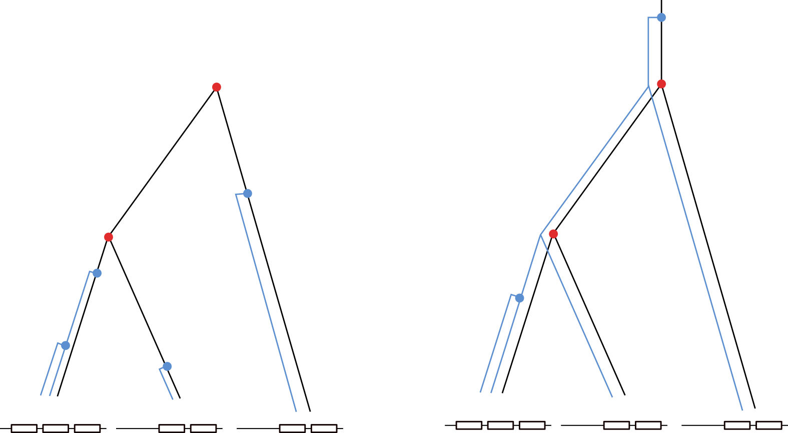
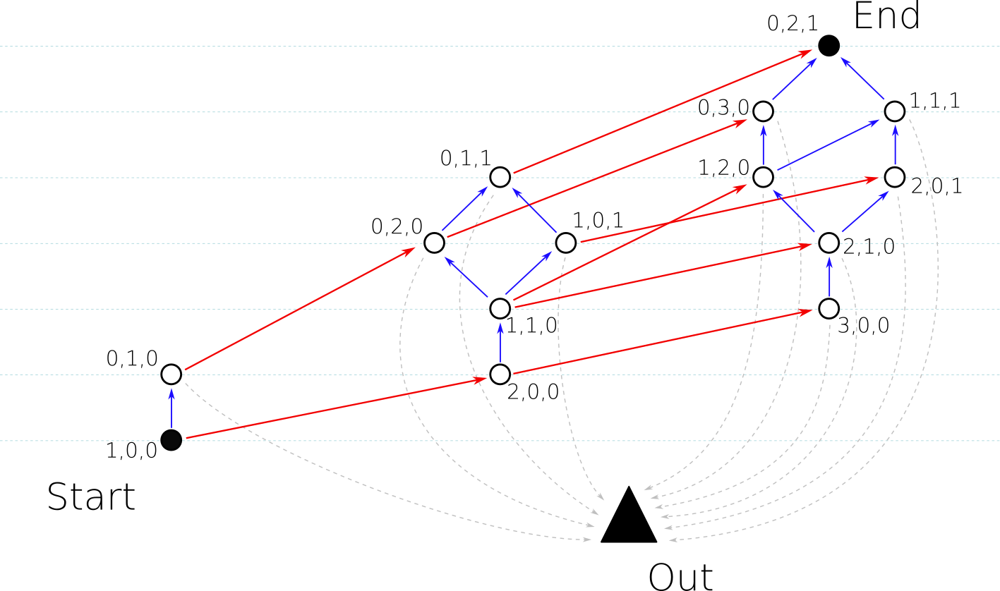

# Inferring the history of gene copy number evolution

All requirements can be imported from "ADG_Complete.py".

See the jupyter notebook "CDN_Notebook.ipynb" for detailed code examples.

## Introduction

Given a present day copy number configuration it remains unclear, whether it was generated by many recent or few ancient duplication events.

We encode a copy number configuration by a vector $$\alpha$$, where $$\alpha_i$$ denotes the number of individuals that have $i$ many copies. For example, 3 individuals with two, two and three copies is encoded as $$\alpha^* = (0,2,1)$$, where we se the * notation to describe the present day configuration.

We model a random walk on the Coalescence duplication network (CDN), which describes all possible paths to reach the desired copy number configuration $$\alpha^*$$. Starting with one lineage with one copy, i.e. $$\alpha^0 = (1,0,0,0,...)$$, it can either generate a new copy with duplication rate $d$ (indicated with blue arrows) or split with probability $1/N$ (red arrows), where $N$ denotes the population size. Due to this process, we may hit configurations $\alpha$, from which we can not reach anymore the desired present day configuration. For example, if we were to jump from (0,1,0) to (0,2,0), we can not reach (0,2,1). Those edges are summarized in the grey lines and point to the state Out.

We then estimate the duplication rate that has led to the present day copy number configuration by maximizing over the probability to reach the desired copy number configuration without hitting the state "Out".

